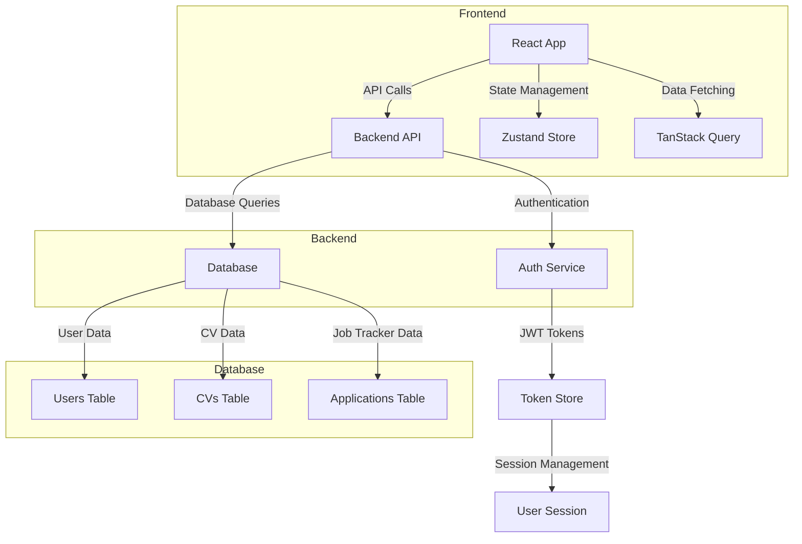
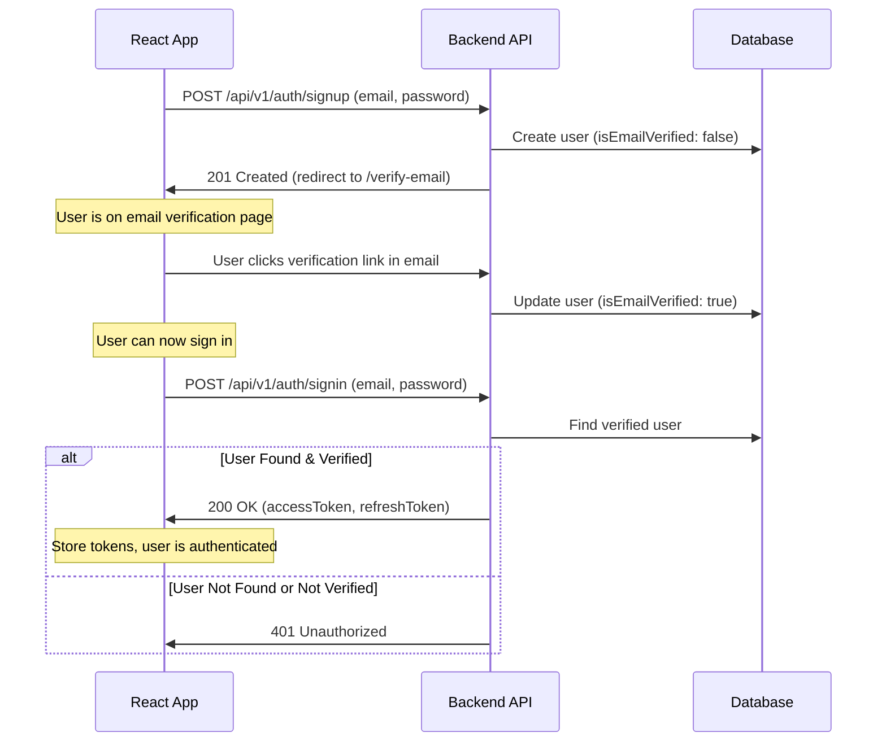
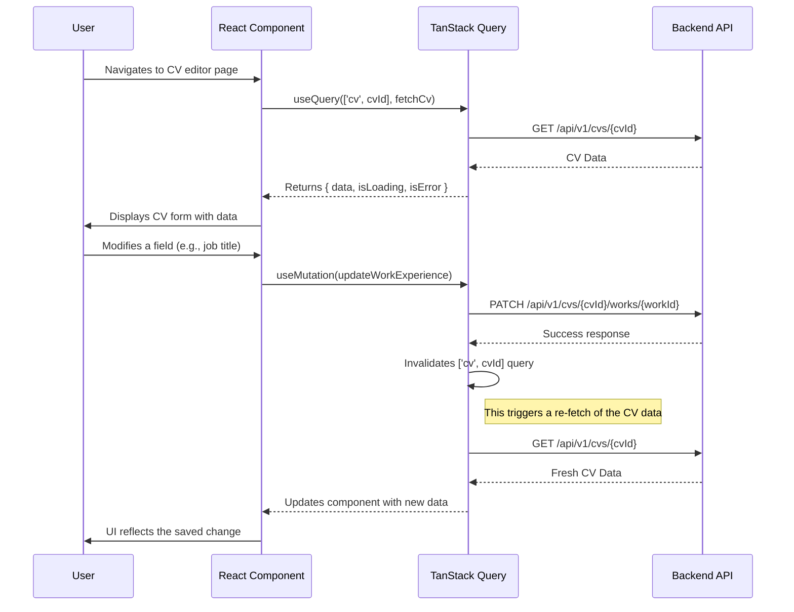

# Developer Documentation: CV Builder & Job Tracker

## 1. Project Overview

This project is a comprehensive tool for career management, built with a modern frontend stack. It allows users to create and manage multiple ATS-friendly CVs, track job applications, and generate cover letters. The application is designed with a domain-driven structure to ensure scalability and maintainability.

**Core Technologies:**

- **React:** For building the user interface.
- **TanStack Router:** For declarative, type-safe routing.
- **TanStack Query:** For data fetching, caching, and state management.
- **TanStack Form:** For type-safe and performant forms.
- **Zustand:** For lightweight global state management (e.g., authentication).
- **Mantine:** For a rich set of UI components.
- **Axios:** For making HTTP requests to the backend API.

## 2. Directory Structure

The project follows a domain-driven design approach, where code is organized by feature domains rather than by technical function. This makes it easier to locate and manage all the code related to a specific part of the application.

```
src/
├── app/                  # Core application setup (routing, stores)
│   ├── routes/           # TanStack Router route definitions
│   └── store/            # Zustand global state stores (e.g., authStore.ts)
│
├── assets/               # Static assets like images and icons
│
├── features/             # Domain-specific features
│   ├── auth/             # Authentication (signup, signin, email verification)
│   │   ├── components/   # React components for auth forms
│   │   ├── guards/       # Route guards for protected routes
│   │   ├── hooks/        # Custom hooks for auth logic (e.g., useSignUp)
│   │   ├── services/     # API service calls for auth endpoints
│   │   └── types/        # TypeScript types for authentication
│   │
│   ├── cv/               # CV creation and management
│   │   ├── components/   # Components for CV sections (work, education, etc.)
│   │   ├── hooks/        # Hooks for managing CV data
│   │   ├── schema/       # Zod schemas for CV form validation
│   │   └── services/     # API service for CV endpoints
│   │
│   ├── tracker/          # Job application tracking
│   │   ├── components/   # Components for the tracker board/table
│   │   ├── hooks/        # Hooks for managing application data
│   │   └── services/     # API service for tracker endpoints
│   │
│   └── cover-letter/     # Cover letter generation
│       ├── components/   # Components for the cover letter editor
│       ├── hooks/        # Hooks for generating and saving cover letters
│       └── services/     # API service for cover letter endpoints
│
├── layouts/              # Reusable page layouts (e.g., DashboardLayout)
│
├── shared/               # Code shared across multiple features
│   ├── api/              # Generic API client configurations
│   ├── components/       # Common, reusable UI components (buttons, inputs)
│   ├── hooks/            # General-purpose custom hooks
│   ├── lib/              # Shared libraries (axios instances, query client)
│   └── utils/            # Utility functions
│
├── styles/               # Global styles and theme configuration
│
└── main.tsx              # Application entry point
```

## 3. Main Features

### 3.1. CV Builder

- **Dynamic Form:** Users can create detailed CVs, adding sections for work experience, education, skills, projects, and more.
- **Multiple CVs:** Users can create and manage multiple versions of their CV, tailored for different job applications.
- **ATS-Friendly Templates:** The output is designed to be easily parsed by Applicant Tracking Systems.

### 3.2. Job Tracker

- **Application Logging:** Users can log every job application, including the company, role, date applied, and current status.
- **Status Tracking:** Applications can be moved through different stages (e.g., Applied, Interviewing, Offer, Rejected).
- **Analytics:** Visualizations show application trends and status distributions over time.

### 3.3. Cover Letter Generator

- **Template-Based:** Users can select a template and quickly generate a cover letter.
- **Dynamic Content:** The generator can pull information from the user's profile and the tracked job application to pre-fill the letter.

## 4. Authentication Flow

The authentication flow is designed to be secure and user-friendly, ensuring that users verify their email before gaining access to the main application.

**Steps:**

1.  **Sign Up:** A new user registers with their email and password. The backend creates the user account but marks it as unverified.
2.  **Email Verification:** The user is redirected to a page instructing them to check their email. An email with a unique verification link is sent.
3.  **Verification Confirmation:** The user clicks the link in the email, which hits a backend endpoint to mark the user's email as verified.
4.  **Sign In:** The user can now sign in with their credentials. The backend returns JWT (access and refresh) tokens.
5.  **Authenticated Access:** The application stores the tokens and uses them to make authenticated requests to protected resources.
6.  **Sign Out:** Tokens are cleared from the client, and the user's session is terminated.

## 5. System Architecture & Data Flow

### High-Level Architecture



### Authentication Data Flow

This diagram shows the sequence of events during the sign-up and sign-in process.



### CV Data Management Flow

This diagram illustrates how CV data is fetched and updated within the application using TanStack Query.


